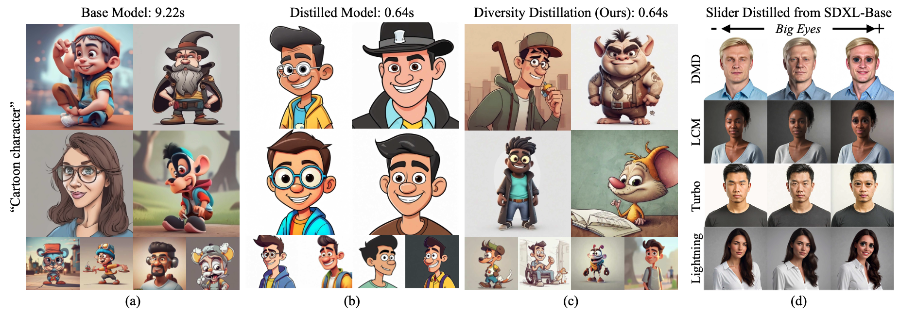

# Distilling Diversity and Control in Diffusion Models
[Project Website](https://distillation.baulab.info) | [ArXiv Preprint](https://arxiv.org/pdf/2503.10637.pdf)

Official code implementation for "Distilling Diversity and Control in Diffusion Models".

<div align='center'>

</div>

## Overview

Distilled diffusion models generate images in far fewer timesteps but suffer from "mode collapse" - producing similar outputs despite different random seeds. Our work addresses this critical limitation through:

1. **Control Distillation**: We discover that control mechanisms (Concept Sliders, LoRAs, DreamBooth) trained on base models can be directly applied to distilled models without retraining.

2. **DT-Visualization**: A novel analysis technique that reveals what diffusion models "think" the final image will be at intermediate steps.

3. **Diversity Distillation**: A hybrid inference approach using the base model for only the first timestep before switching to the distilled model, restoring diversity while maintaining speed.

## Setup

```bash
conda create -n distillation python=3.9
conda activate distillation

git clone https://github.com/rohitgandikota/distillation.git
cd distillation
pip install -r requirements.txt
```

## DT-Visualization
For DT-Visualization - see `dt-visualization.ipynb` notebook

## Diversity Distillation
To improve the diversity of your distilled model - use the notebook `diversity_distillation.ipynb`

For generating multiple images using a bash script, use the following python evaluation script

```python
python evalscripts/diversity_distillation_sdxl.py --distillation_type 'dmd' --prompts_path 'data/coco_30k.csv' --exp_name 'dmd_diversity_distillation' --device 'cuda:0'
```

## Citing our work

```bibtex
@article{gandikota2025distilling,
  title={Distilling Diversity and Control in Diffusion Models},
  author={Rohit Gandikota and David Bau},
  journal={arXiv preprint arXiv:2503.10637}
  year={2025}
}
```
